# Ansible Workshop - Ansible for Red Hat Enterprise Linux Security Automation

This 90-minute workshop provides you with a hands on set of exercises that aim to introduce you to how Ansible and the Red Hat Ansible Automation Platform could be used for day to day security operations. 

## Table of Contents

* [Table of Contents](#table-of-contents)
* [Prerequisites](#Prerequisites)
* [Presentations](#presentations)
* [Time planning](#time-planning)
* [Lab Diagram](#lab-diagram)
* [Disclaimer](#Disclaimer)
* [Ansible Automation Platform Exercises](#ansible-automation-platform-exercises)

## Prerequisites

* This Workshop assumes some knowledge of Ansible and the Ansible Automation Platform. 
* Each attendee is required to have a `github` account. If you do not have one, you can register for a free account on [github.com](https://github.com/signup)
* This workshop assumed previous knowledge and working experience with git based SCM systems like github 

## Presentations

The exercises are self explanatory and guide the participants through the entire lab.

## Time planning

This workshop was created to last about 90 minutes.

## Lab Diagram


## Disclaimer

For this workshop, we chose a LAMP stack as our target for security policies, however this workshop is not about the specific technology being secured, but about the concepts, framework and methodology used. The Workshop is less about the actual steps to Secure the LAMP stack, and more about how we went about approaching the security tasks. All the concepts are applicable to your specific technologies, please keep that in mind.

## Ansible Automation Platform Exercises

*************************************************************************************************

# Section 0: Introduction and Initial Setup

## Step 1 - Setup the Security Workshop Project

The lab environment described above will need to be configured before going through the exercises in this workshop, and to do so a playbook has been written to do the following:
* Stop `firewalld` and install, start and enable `auditd` on all the RHEL hosts.
* Install and configure `MariaDB` on `node3` (by default) to act as the backend for our sample webapp. 
    * A sample database `webapp_db` will be created, and populated with a simple table containing information on the name and version of our application. 
    * a user `webapp` that can connect to the database from any host and does not require an encrypted connection.
    * Database will not initially be configured to use SSL
    * Database will be configured to use a non default port , 3389
    * Database will be configured to listen for connections from all hosts
* Install and configure `Apache` and `PHP` on `node1` and `node2` (by default) to act as our webservers.
    * A simple php page will be deployed to the docroot that connects to the `MariaDB` server and display the name and version of the application
    * The php page will also display information on the status of the database session with regards to the `SSL Cipher` and `SSL Version` if and only if the connection uses SSL.
    * The server listens on port 80 (http), and does not listen on 443 (https).

<br>

In order to import the setup playbook into Automation Controller, we will need to define a new project.
To start, log on to Automation Controller using your environment details, click **Projects** and click on the  icon. Use the following values for your new Project:

| Key                              | Value                                                             | Note |
|----------------------------------|-------------------------------------------------------------------|------|
| Name                             | Initial Setup Project                                             |      |
| Description                      | Initial Setup for the RHEL Security Workshop                      |      |
| Organization                     | Default                                                           |      |
| Execution Environment            | Leave Blank                                                       |      |
| Source Control Type              | Git                                                               |      |
| Source Control URL               | Clone the URL of the git repo you are reading the instructions on |      |
| Source Control Branch/Tag/Commit | Leave Blank                                                       |      |
| Source Control Refspec           | Leave Blank                                                       |      |
| Source Control Credential        | Leave Blank                                                       |      |
| Options                          | None Selected                                                     |      |

Project Definition will look like this: 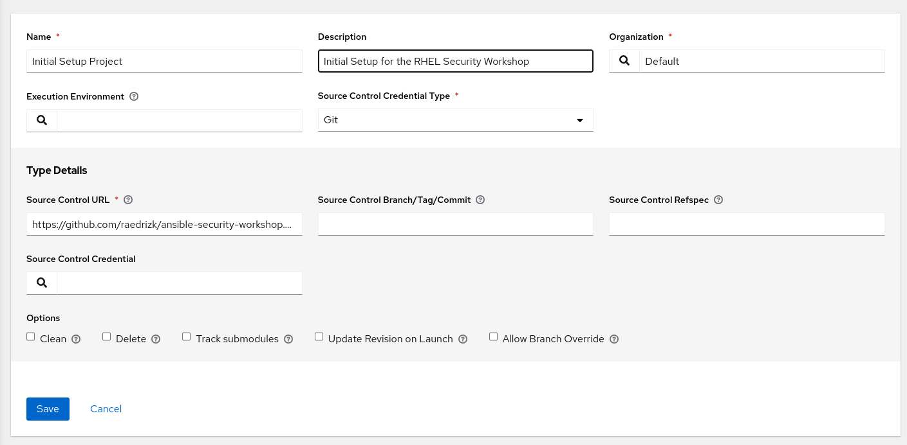


click on the  icon, and you will be redirected to the project details page, and a Job will automatically be created to sync the project in Controller. Wait until the `Last Job Status` shows . If you get a failure, click the edit button, verify that you entered the project details correctly and save the project.

> **Tip**
>
> We will be setting up another project later to host the playbooks we will write during this workshop.

## Step 2 - Create the `Workshop Initial Setup` Job template

Now that the project sync is complete, Select **Templates** and click on the  icon, and select `Add Job Template`. Use the following values for your new Template:

| Key         | Value                                            | Note |
|-------------|--------------------------------------------------|------|
| Name        | Workshop Initial Setup                           |      |
| Description | Initial setup and configuration of the workshop  |      |
| Job Type    | Run                                              |      |
| Inventory   | Workshop Inventory                               |      |
| Project     | Initial Setup Project                            |      |
| Execution Environment | rhel workshop execution environment    |      |
| Playbook    | `lab-setup.yml`                                  |      |
| Credential  | Type: **Machine**. Name: **Workshop Credential** |      |
| Limit       | web                                              |      |
| Options     | None Selected                                    |      |

<br>

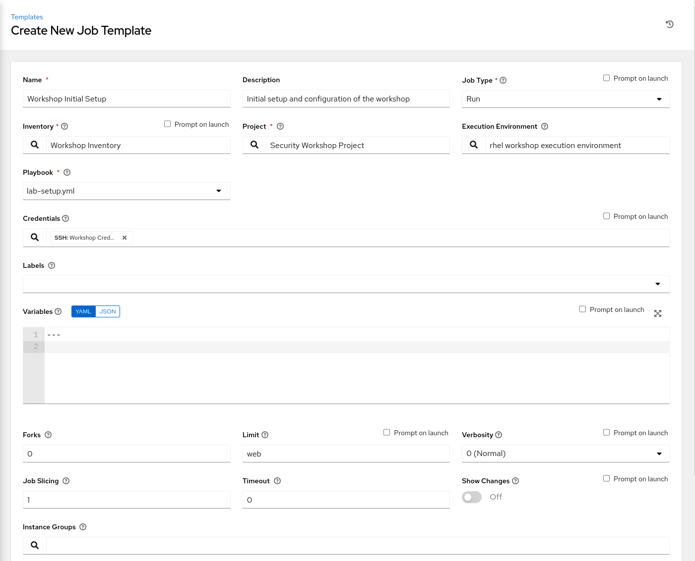

Click SAVE and then Click LAUNCH to run the job. The job will start running, and you will be able to see the output. Take a look at the tasks in the output panel to get an idea of what the setup playbook is doing. The job should complete successfully and you should be able to scroll through the details of the workshop configuration job output. 

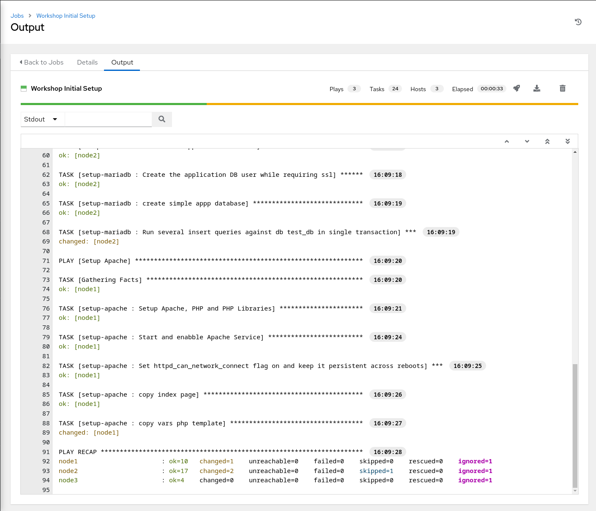

The initial configuration for the workshop is now complete.

## Step 3 - Validate the setup

The lab environment should now be setup as descibed earlier with MariaDB and Apache running. In order to validate, we can visit the web server to see the application that was deployed. Click **Inventories**
on the left panel, and then click the name of our Inventory **Workshop Inventory**. Now that you are on the Inventory Details page, we will need to go select our Host. So click **HOSTS**, and click on **node1** since that is one of the webserver nodes (by default) and inspect the node's IP address under the `variables` section. 

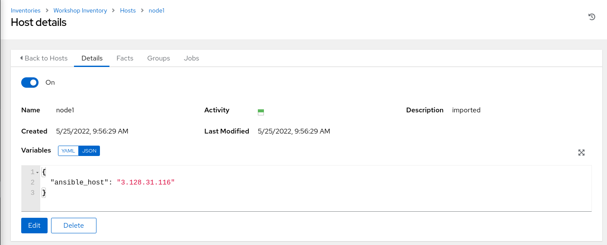

> **Tip**
>
> The IP Address in your inventory will be different than the one in the screenshot above. Make sure you use the address specific to your lab environment.

> **Tip**
>
> You can use either one of the webserver nodes `node1` or `node2` to view the appication now or in upcoming exercises. The instructions will always refer to `node1` for simplicity, but feel free to check `node2` or both!

Copy that IP address and launch a new browser windows or tab and put in `http://<NODE1's_IP_ADDRESS_YOU_JUST_COPIED>` and look at the webpage:

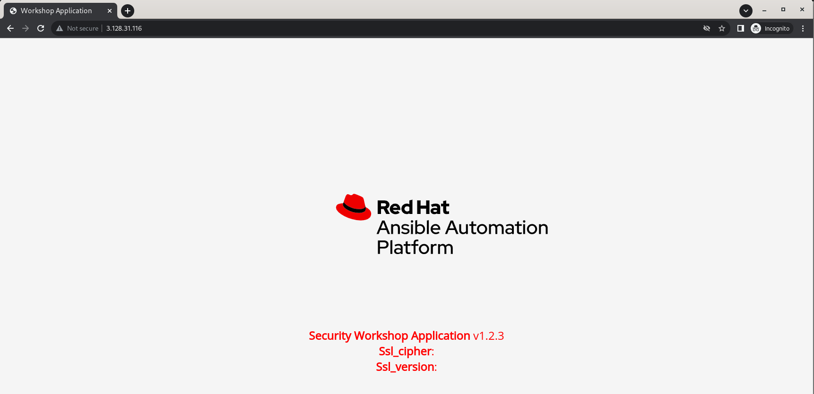

What you are seeing is the PHP application that was deployed, where the name of the application and its version are retrieved from the MariaDB instance installed on `node2`. There are also 2 variables on the page being shown, `Ssl_version` and `Ssl_cipher`, and both have no values being shown. These variables are showing the status of the database session signifying that the connection between the application and the database is not encrypted.

> **Tip**
>
> Find more information on  MySQL Encrypted Connection TLS Protocols and Ciphers [here](https://dev.mysql.com/doc/refman/5.7/en/encrypted-connection-protocols-ciphers.html).

Now try using `https` to access the same page by going to `https://<NODE1's_IP_ADDRESS_YOU_JUST_COPIED>`. You should get an `ERR_CONNECTION_REFUSED` error page. That is expected since Apache was only configured to listen for http connections.

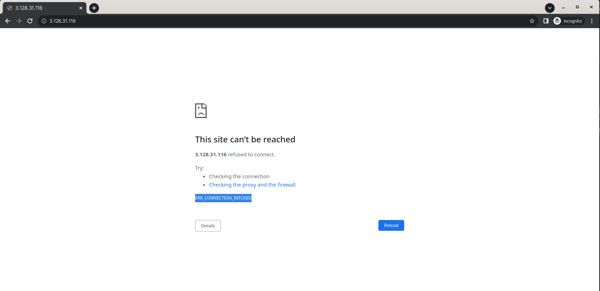


Now that the setup is complete, we can introduce the framework that we will be using for this workshop, and that is the `NIST Cybersecurity Framework Version 1.1` as shown in the following diagram *(Credit: N. Hanacek/NIST)*:

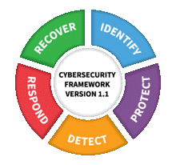

In this workshop, we will cover all the stages of this framework on a very small subset of requirements to convey how Ansible and the Red Hat Ansible Automation Platform could be valuable to security teams looking for a way to automate and streamline their day to day security processes and requirements.


# Section 1: IDENTIFY

In the first section we will discuss the `IDENTIFY` stage of the framework by defining the requiremnents that should be met/enforced. These requirements are going to be our target for the remainder of this workshop as we work on their enforcement.

For this workshop we will assume that the security team have highlighted the following requirements with regards to LAMP stacks:

1. **All traffic between the web application and the database should be encrypted.**
2. **All traffic to the web application should be encrypted.** 

Based on the initial setup of the workshop described earlier, we can tell that to meet those requirements, we have some work to do!:
1. We know that the webserver only listens for http traffic
2. Based on the variables displayed for the database session information, we know that the communication to the database is unencrypted. 

Now that we have identified what we need to address based on the requirements, in the next section we will use Ansible to write a playbook that will enforce these requirements.

> **Tip**
>
> Make sure that your editor of choice (your own IDE or Visual Studio Code provided with your environment details) is configured with account information to be able to push code to a repository before proceeding to section 2.


# Section 2: PROTECT

With our requirements in hand, let us begin the process of automating these requirements. We will begin by enabling SSL for the database. For MariaDB, this requires that we edit the database configuration file to define the CA Cert, Server Cert and Server Key. For the purpose of this workshop, we will be using self signed certificates that we will create but in a real environment, chances are that there will be a set of certificates already issued for that purpose, that however will not change much other than omit the need to generate those certificates, and instead copy them directly to the database server, so if anything it would be even easier.

> **Tip**
>
> For more information on securing MariaDB connectuons, please look at the [docs](https://mariadb.com/kb/en/securing-connections-for-client-and-server/).

## Step 1 - Preparing your Project and Automation Controller

This workshop assumes you have a github account, and are familiar and comfortable working with git based SCMs. for the purposes of this workshop, create a new repository by signing into `github.com`, going to repositories and clicking on the `New` button. Name the repository `ansible-rhel-security-workshop` and leave the repo as public. This is the project we will be using for the playbooks we write for the exercises in this workshop.

> **Tip**
>
> If you want to make your repository private, you can, you will just have to make sure to add a new SCM credential to Automation Controller later on and specify that credential in your project definition later on when defining the project.


Next you will need to clone and configure your git project, The steps will differ if you are using your own machine wih your own IDE, or using the VSCode instance provisioned for you with theis workshop.

Once everything is setup and ready, in your project directory, create a new folder named `collections` and in that folder create a file named `requirements.yml` to hold the information about the collections containing some of the modules that we will be using. Automation Controller is configured to download the collections in the `requirements.yml` file automatically when the project is synced.

Place the following in the `requirements.yml` file:

```yaml
---
collections:
  - community.crypto
  - community.mysql
  - community.general
  - ansible.posix
```
your directory structure in your project folder should look like this:

```
.
├── collections
│   └── requirements.yml
```
Commit and Push your files to github, and then move to Automation Controller. Log on to Automation Controller using your environment details, click **Projects** and click on the  icon. Use the following values for your new Project:

| Key                              | Value                                                                       | Note |
|----------------------------------|-----------------------------------------------------------------------------|------|
| Name                             | Security Workshop Project                                                   |      |
| Description                      | Project containing Playbooks for the RHEL Security Workshop                 |      |
| Organization                     | Default                                                                     |      |
| Execution Environment            | Leave Blank                                                                 |      |
| Source Control Type              | Git                                                                         |      |
| Source Control URL               | Clone the URL of the git repo you created                                   |      |
| Source Control Branch/Tag/Commit | Leave Blank                                                                 |      |
| Source Control Refspec           | Leave Blank                                                                 |      |
| Source Control Credential        | Leave Blank (Unless your repo is private, then choose your SCM credential)  |      |
| Options                          | `Update Revision on Launch` Selected                                        |      |


Project Definition will look like this: 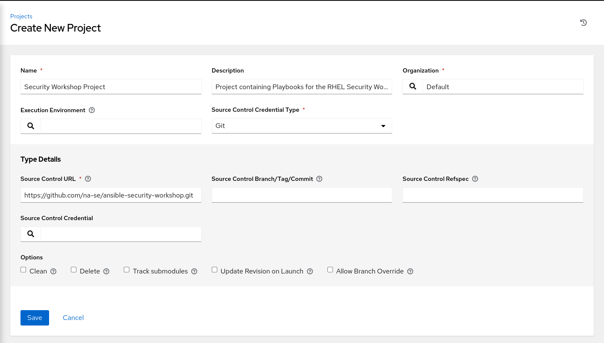


click on the  icon, and you will be redirected to the project details page, and a Job will automatically be created to sync the project in Controller. Wait until the `Last Job Status` shows . If you get a failure, click the edit button, verify that you entered the project details correctly and save the project.


## Step 2 - Enabling SSL on MariaDB: writing the playbook


In your project directory, create a folder named `vars` and in that folder create a file named `ssl-vars.yml` to hold some of the variables we will be passing to our playbook. Place the following in the `ssl-vars.yml` file:

```yaml
---
#Apache Variables
apache_host: 
- node1
- node2
apache_config_file: /etc/httpd/conf.d/ssl.conf
apache_host_docroot: /var/www/html
apache_certs_path: /var/webapp

#MariaDB Variables
mariadb_host: node3
mariadb_port: 3389
mariadb_system_user: mysql
mariadb_system_group: mysql
mariadb_username: webapp
mariadb_db_name: webapp_db
mysql_db_password_file: /tmp/mysql-password
mariadb_config_file: /etc/my.cnf.d/mariadb-server.cnf
mariadb_certs_path: /etc/pki/tls/private
mariadb_ca_key_name: ca-key.pem
mariadb_ca_cert_name: ca-cert.pem
mariadb_server_key_name: server-key.pem
mariadb_server_cert_name: server-cert.pem
```


Now we are ready to start writing the playbook. In your project directory root create a new file called `setup-ssl.yml` and begin by defining a play that targets the `mariadb_host`.

```yaml
---
- name: Configure SSL on mysql
  hosts: "{{ mariadb_host }}"
  gather_facts: False
  vars_files: vars/ssl-vars.yml
  tags: 
  - mysql
  become: True
```

Since we will not need or use any of the facts gathered by Ansible,  we have disabled fact gathering by setting `gather_facts: false` to decrease overhead. We also pointed to the variables file we created earlier. We set the `become` directive to `True` to run our tasks as a privileged user, and we tagged the play with a `mysql` tag.

Next we will add our tasks to the play by adding the following to the same `setup-ssl.yml` file:


```yaml
  tasks:
     
  - name: Make sure that the directory to hold keys and certs exist
    ansible.builtin.file:
      path: "{{ mariadb_certs_path }}"
      state: directory

  - name: Generate a new 2048 bit key
    community.crypto.openssl_privatekey:
      path: "{{ mariadb_certs_path }}/{{ mariadb_ca_key_name }}"
      size: 2048
      group: "{{ mariadb_system_user }}"
      owner: "{{ mariadb_system_group }}"
      mode: 0660
    register: ca_key

  - name: Create certificate signing request (CSR) for CA certificate
    community.crypto.openssl_csr_pipe:
      privatekey_path: "{{ ca_key.filename }}"
      common_name: "{{ inventory_hostname }}"
      use_common_name_for_san: false  
      basic_constraints:
        - 'CA:TRUE'
    register: ca_csr

  - name: Create The CA self-signed certificate
    community.crypto.x509_certificate:
      path: "{{ mariadb_certs_path }}/{{ mariadb_ca_cert_name }}"
      csr_content: "{{ ca_csr.csr }}"
      privatekey_path: "{{ ca_key.filename }}"
      provider: selfsigned
      group: "{{ mariadb_system_user }}"
      owner: "{{ mariadb_system_group }}"
      mode: 0660
    register: ca_crt

  - name: Create the private key for the server
    community.crypto.openssl_privatekey:
      path: "{{ mariadb_certs_path }}/{{ mariadb_server_key_name }}"
      size: 2048
      group: "{{ mariadb_system_user }}"
      owner: "{{ mariadb_system_group }}"
      mode: 0660
    register: server_key

  - name: Create certificate signing request  for Server certificate
    community.crypto.openssl_csr_pipe:
      privatekey_path: "{{ server_key.filename }}"
      common_name: "{{ inventory_hostname }}.example.com"
      use_common_name_for_san: false  
    register: server_csr

  - name: Sign thethe CSR for the server
    community.crypto.x509_certificate:
      path: "{{ mariadb_certs_path }}/{{ mariadb_server_cert_name }}"
      csr_content:  "{{ server_csr.csr }}"
      provider: ownca
      ownca_path: "{{ ca_crt.filename }}"
      ownca_privatekey_path: "{{ ca_key.filename }}"
      group: "{{ mariadb_system_user }}"
      owner: "{{ mariadb_system_group }}"
      mode: 0660
    register: ca_crt
```

Looking at the set of tasks we just added:
 * We start off by using the `ansible.builtin.file` module to verify that the directory used to hold the certificates is present.
 * next we use the `openssl_privatekey` module from the `community.crypto` collection to generate a 2048 BIT RSA Key for the CA certificate.
 * Then we use the `openssl_csr_pipe` and the `x509_certificate` modules from the `community.crypto` collection to create a signing request and the CA certificate using the key created before.
 * We then go through the same process again to generate the key and certificate for the server.

 > **Tip**
>
> Note that while we use the same set of tasks to generate the CA key and certificate and the Server key and certificate, each set of tasks have different configurations to control the Certificate generation for values such as the provider and the common name. For more information on the available paramaters, and other related modules, check out the `community.crypto` [docs](https://galaxy.ansible.com/community/crypto)


Next we will configure MariaDB to point  to the new certificates that we just generated by editing the server configuration file. We will need to add a handler to make sure that the database server  is restarted to pick up the new configurations if any changes are made to the configuration file. Add the following task and handler section to your play:

```yaml
  - name: Configure custom port and remote listening and enable SSL
    ansible.builtin.blockinfile:
      path: "{{ mariadb_config_file }}"
      insertafter: "[mysqld]"
      block: |
        #BIND ADDRESS AND PORT
        bind-address=0.0.0.0
        port={{ mariadb_port }}
        #SSL CONFIG
        ssl-ca={{ mariadb_certs_path }}/{{ mariadb_ca_cert_name }}
        ssl-cert={{ mariadb_certs_path }}/{{ mariadb_server_cert_name }}
        ssl-key={{ mariadb_certs_path }}/{{ mariadb_server_key_name }}
    notify:
    - restart mysql

  handlers:
  - name: restart mysql
    ansible.builtin.service:
      name: mariadb
      state: restarted
      enabled: True  
```

The full playbook should now look like this:

```yaml
---
- name: Configure SSL on mysql
  hosts: "{{ mariadb_host }}"
  gather_facts: False
  vars_files: vars/ssl-vars.yml
  tags: 
  - mysql
  become: True
  tasks:
     
  - name: Make sure that the directory to hold keys and certs exist
    ansible.builtin.file:
      path: "{{ mariadb_certs_path }}"
      state: directory

  - name: Generate a new 2048 bit key
    community.crypto.openssl_privatekey:
      path: "{{ mariadb_certs_path }}/{{ mariadb_ca_key_name }}"
      size: 2048
      group: "{{ mariadb_system_user }}"
      owner: "{{ mariadb_system_group }}"
      mode: 0660
    register: ca_key

  - name: Create certificate signing request (CSR) for CA certificate
    community.crypto.openssl_csr_pipe:
      privatekey_path: "{{ ca_key.filename }}"
      common_name: "{{ inventory_hostname }}"
      use_common_name_for_san: false  
      basic_constraints:
        - 'CA:TRUE'
    register: ca_csr

  - name: Create The CA self-signed certificate
    community.crypto.x509_certificate:
      path: "{{ mariadb_certs_path }}/{{ mariadb_ca_cert_name }}"
      csr_content: "{{ ca_csr.csr }}"
      privatekey_path: "{{ ca_key.filename }}"
      provider: selfsigned
      group: "{{ mariadb_system_user }}"
      owner: "{{ mariadb_system_group }}"
      mode: 0660
    register: ca_crt

  - name: Create the private key for the server
    community.crypto.openssl_privatekey:
      path: "{{ mariadb_certs_path }}/{{ mariadb_server_key_name }}"
      size: 2048
      group: "{{ mariadb_system_user }}"
      owner: "{{ mariadb_system_group }}"
      mode: 0660
    register: server_key

  - name: Create certificate signing request  for Server certificate
    community.crypto.openssl_csr_pipe:
      privatekey_path: "{{ server_key.filename }}"
      common_name: "{{ inventory_hostname }}.example.com"
      use_common_name_for_san: false  
    register: server_csr

  - name: Sign thethe CSR for the server
    community.crypto.x509_certificate:
      path: "{{ mariadb_certs_path }}/{{ mariadb_server_cert_name }}"
      csr_content:  "{{ server_csr.csr }}"
      provider: ownca
      ownca_path: "{{ ca_crt.filename }}"
      ownca_privatekey_path: "{{ ca_key.filename }}"
      group: "{{ mariadb_system_user }}"
      owner: "{{ mariadb_system_group }}"
      mode: 0660
    register: ca_crt

  - name: Configure custom port and remote listening and enable SSL
    ansible.builtin.blockinfile:
      path: "{{ mariadb_config_file }}"
      insertafter: "[mysqld]"
      block: |
        #BIND ADDRESS AND PORT
        bind-address=0.0.0.0
        port=3389
        #SSL CONFIG
        ssl-ca={{ mariadb_certs_path }}/{{ mariadb_ca_cert_name }}
        ssl-cert={{ mariadb_certs_path }}/{{ mariadb_server_cert_name }}
        ssl-key={{ mariadb_certs_path }}/{{ mariadb_server_key_name }}
    notify:
    - restart mysql

  handlers:
  - name: restart mysql
    ansible.builtin.service:
      name: mariadb
      state: restarted
      enabled: True  
```

Save your playbook, make sure that your project directory structure looks like this:
```
.
├── collections
│   └── requirements.yml
├── setup-ssl.yml
└── vars
    └── ssl-vars.yml
```

Commit and push your playbook to github.

## Step 3 - Enabling SSL on MariaDB: running the playbook

Back in Automation Controller, click **Projects** and click on the  icon next to your `Security Workshop Project`. Wait until the project refresh finishes, then select **Templates** and click on the  icon, and select `Add Job Template`. Use the following values for your new Template:

| Key         | Value                                            | Note |
|-------------|--------------------------------------------------|------|
| Name        | SSL Setup                           |      |
| Description | Configuring SSL for MariaDB and Apache  |      |
| Job Type    | Run                                              |      |
| Inventory   | Workshop Inventory                               |      |
| Project     | Security Workshop Project                            |      |
| Execution Environment | rhel workshop execution environment             |      |
| Playbook    | `setup-ssl.yml`                |      |
| Credential  | Type: **Machine**. Name: **Workshop Credential**     |      |
| Limit       | web                                          |      |
| Options     |                                                  |      |


Click SAVE and then Click LAUNCH to run the job. It may take a minute for the job to start running, and you will be able to see the output once it does. Once the job run completes, the MariaDB instance will be configured to use SSL, however if we visit the IP address of `node1` we will still see no values for the `Ssl_version` and `Ssl_cipher`, the reason being that even though we configured MariaDB to use SSL connections, we are not requiring the user that the application connects with to use TLS. so go back to your IDE, and add the following tasks in the tasks section:

```yaml
  - name: Read the generated password
    ansible.builtin.slurp:
      src: "{{ mysql_db_password_file }}"
    register: mysql_password

  - name: Setting host facts for the mysql password
    ansible.builtin.set_fact:
      webapp_password: "{{ mysql_password['content'] | b64decode | trim }}"

  - name: Read the generated ca-cert.pem file
    ansible.builtin.slurp:
      src: "{{ mariadb_certs_path }}/{{ mariadb_ca_cert_name }}"
    register: cacert

  - name: Setting host facts for the CA cert
    ansible.builtin.set_fact:
      cacert_contents: "{{ cacert['content'] | b64decode | trim }}"

  - name: Modifying the Application DB User to require SSL
    community.mysql.mysql_user:
      login_host: localhost
      login_port: "{{ mariadb_port }}"
      login_user: root
      login_password: "{{ webapp_password }}"
      name: "{{ mariadb_username }}"
      host: '%'
      password: "{{ webapp_password }}"
      priv: '*.*:ALL'
      tls_requires:
        ssl:
      state: present
```

The newly added tasks will do the following:
* use the `ansible.builtin.slurp` module to read the mysql password and set a host fact to hold that value. (Usually the password will be stored in Controller's credentials and read from there, but it is stored in a temp file for ease of provisioning)
* use the `ansible.builtin.slurp` module to read the contents of the CA certificate and set a host fact to hold that value (This is more related to configuring the application later).
* use the `mysql_user` module from the `community.mysql` collection to modify the `webapp` user to require SSL.

So the full playbook looks like this:

```yaml
---
- name: Configure SSL on mysql
  hosts: "{{ mariadb_host }}"
  gather_facts: False
  vars_files: vars/ssl-vars.yml
  tags: 
  - mysql
  become: True
  tasks:
     
  - name: Make sure that the directory to hold keys and certs exist
    ansible.builtin.file:
      path: "{{ mariadb_certs_path }}"
      state: directory

  - name: Generate a new 2048 bit key
    community.crypto.openssl_privatekey:
      path: "{{ mariadb_certs_path }}/{{ mariadb_ca_key_name }}"
      size: 2048
      group: "{{ mariadb_system_user }}"
      owner: "{{ mariadb_system_group }}"
      mode: 0660
    register: ca_key

  - name: Create certificate signing request (CSR) for CA certificate
    community.crypto.openssl_csr_pipe:
      privatekey_path: "{{ ca_key.filename }}"
      common_name: "{{ inventory_hostname }}"
      use_common_name_for_san: false  
      basic_constraints:
        - 'CA:TRUE'
    register: ca_csr

  - name: Create The CA self-signed certificate
    community.crypto.x509_certificate:
      path: "{{ mariadb_certs_path }}/{{ mariadb_ca_cert_name }}"
      csr_content: "{{ ca_csr.csr }}"
      privatekey_path: "{{ ca_key.filename }}"
      provider: selfsigned
      group: "{{ mariadb_system_user }}"
      owner: "{{ mariadb_system_group }}"
      mode: 0660
    register: ca_crt

  - name: Create the private key for the server
    community.crypto.openssl_privatekey:
      path: "{{ mariadb_certs_path }}/{{ mariadb_server_key_name }}"
      size: 2048
      group: "{{ mariadb_system_user }}"
      owner: "{{ mariadb_system_group }}"
      mode: 0660
    register: server_key

  - name: Create certificate signing request  for Server certificate
    community.crypto.openssl_csr_pipe:
      privatekey_path: "{{ server_key.filename }}"
      common_name: "{{ inventory_hostname }}.example.com"
      use_common_name_for_san: false  
    register: server_csr

  - name: Sign thethe CSR for the server
    community.crypto.x509_certificate:
      path: "{{ mariadb_certs_path }}/{{ mariadb_server_cert_name }}"
      csr_content:  "{{ server_csr.csr }}"
      provider: ownca
      ownca_path: "{{ ca_crt.filename }}"
      ownca_privatekey_path: "{{ ca_key.filename }}"
      group: "{{ mariadb_system_user }}"
      owner: "{{ mariadb_system_group }}"
      mode: 0660
    register: ca_crt

  - name: Configure custom port and remote listening and enable SSL
    ansible.builtin.blockinfile:
      path: "{{ mariadb_config_file }}"
      insertafter: "[mysqld]"
      block: |
        #BIND ADDRESS AND PORT
        bind-address=0.0.0.0
        port={{ mariadb_port }}
        #SSL CONFIG
        ssl-ca={{ mariadb_certs_path }}/{{ mariadb_ca_cert_name }}
        ssl-cert={{ mariadb_certs_path }}/{{ mariadb_server_cert_name }}
        ssl-key={{ mariadb_certs_path }}/{{ mariadb_server_key_name }}
    notify:
    - restart mysql

  - name: Read the generated password
    ansible.builtin.slurp:
      src: "{{ mysql_db_password_file }}"
    register: mysql_password

  - name: Setting host facts for the mysql password
    ansible.builtin.set_fact:
      webapp_password: "{{ mysql_password['content'] | b64decode | trim }}"

  - name: Read the generated ca-cert.pem file
    ansible.builtin.slurp:
      src: "{{ mariadb_certs_path }}/{{ mariadb_ca_cert_name }}"
    register: cacert

  - name: Setting host facts for the CA cert
    ansible.builtin.set_fact:
      cacert_contents: "{{ cacert['content'] | b64decode | trim }}"

  - name: Modifying the Application DB User to require SSL
    community.mysql.mysql_user:
      login_host: localhost
      login_port: "{{ mariadb_port }}"
      login_user: root
      login_password: "{{ webapp_password }}"
      name: "{{ mariadb_username }}"
      host: '%'
      password: "{{ webapp_password }}"
      priv: '*.*:ALL'
      tls_requires:
        ssl:
      state: present

  handlers:
  - name: restart mysql
    ansible.builtin.service:
      name: mariadb
      state: restarted
      enabled: True  
``` 
Commit and push your playbook to github. Back in Automation Controller , go to templates and click the  icon next to your `SSL Setup` Job Template. The job will rerun, but now it will edit the database user to require SSL.

After the job completes, go back and refresh the URL of `node1` which was `http://<NODE1's_IP_ADDRESS>` , and you should see the following:

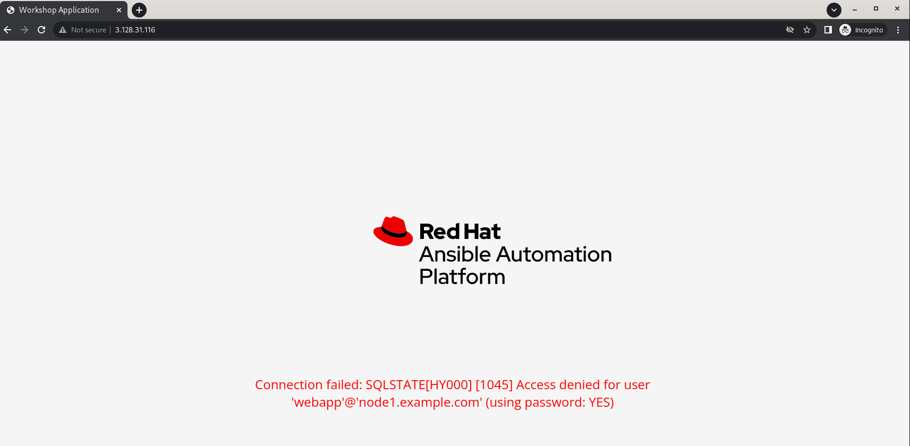

The connection failure error confirms that since the database user now requires SSL, and the web application was not configured to use SSL in the first place, we are on the right track.

> **Tip**
>
> We did not need to manually refresh our project because it was configured with the `Update Revision on Launch` option Selected, which will automatically trigger a project update everytime we kick off a Job template that uses a playbook sourced from that project source, pulling down the latest version of the playbook.

## Step 4 - Configuring SSL on Apache: writing the playbook

Now we will configure our application to talk to the database over an encrypted connection. Since this is a PHP Application connecting to MariaDB using the PDO driver, we will have to modify the connection details to use SSL, and verify the Server's certificate using the CA.

Going back to our Project, create a new directory called `templates`, and in that directory create a file named `dbvars.php.j2`. Your directory structure should look like this:

```
.
├── collections
│   └── requirements.yml
├── setup-ssl.yml
├── templates
│   └── dbvars.php.j2
└── vars
    └── ssl-vars.yml
```
In that file, place the following:

```php
<?php
/**
 * @var string $servername
 * @var string $port
 * @var string $username
 * @var string $password
 * @var string $dbname
 * @var string $sslca
 */
$servername = "{{ mariadb_host }}.example.com";
$port = "{{ mariadb_port }}";
$username = "{{ mariadb_username }}";
$password = "{{ hostvars[mariadb_host]['webapp_password'] }}";
$dbname = "{{ mariadb_db_name }}";
$sslca = "{{ apache_host_docroot }}/{{ mariadb_ca_cert_name }}";
$options = array(
    PDO::MYSQL_ATTR_INIT_COMMAND => 'SET NAMES utf8',
    PDO::MYSQL_ATTR_SSL_CA => $sslca,
    PDO::MYSQL_ATTR_SSL_VERIFY_SERVER_CERT => true
);
?>
```

These are the variables that are used by the PDO driver to establish the database connection. The initial setup playbook deployed a similar file with a different `$options` array.


Now going back to your `setup-ssl.yml`, we will add a second play that targets the `apache_host`:

```yaml
- name: Configure SSL for apache
  hosts: "{{ apache_host }}"
  gather_facts: False
  vars_files: vars/ssl-vars.yml
  tags: 
  - apache
  become: True
  tasks:
  - name: Create a file with the contents of the ca cert generated on the mariaDB host
    ansible.builtin.copy:
      content: "{{ hostvars[mariadb_host]['cacert_contents'] }}"
      dest: "{{ apache_host_docroot }}/{{ mariadb_ca_cert_name }}"
      
  - name: copy vars php template
    ansible.builtin.template:
      src: templates/dbvars.php.j2
      dest: "{{ apache_host_docroot }}/dbvars.php"

```

The new play currently has a couple of tasks:

* The first task Creates the CA cert in the Apache docroot. The Cert will be used by the PDO driver to verify the identity of the database Server when connecting to it.
* The second task will create the php file that holds the new set of variables that will be used for the SSL connection.

Commit and push your playbook to github. Back in Automation Controller , go to templates and click the  icon next to your `SSL Setup` Job Template. Take a look at the output, and notice the new tasks being run. After the job completes, refresh the URL of `node1` which was `http://<NODE1's_IP_ADDRESS>` , and you should see the following:

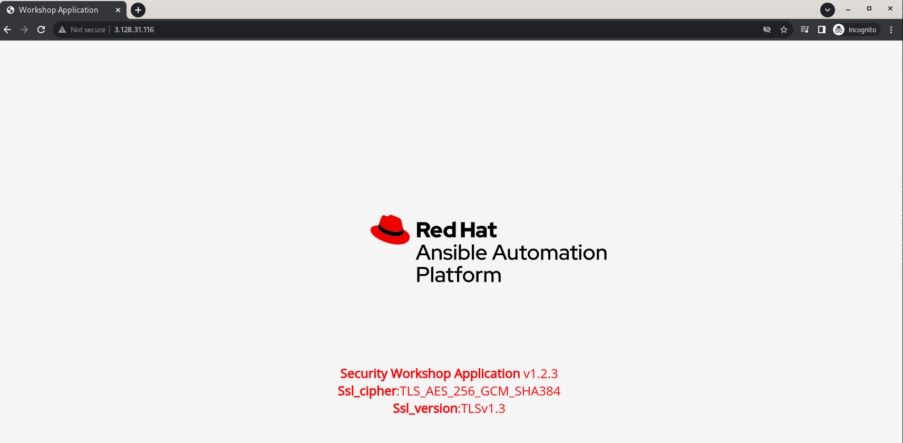

The application is now able to connect to the database backend again, but this time the values for the `Ssl_version` and `Ssl_cipher`being shown indicate that the connection to the database is Encrypted using the SSL Version shown in the `Ssl_version` variable, using the Cipher shown in the `Ssl_cipher` variable. We now have a playbook that can enforce the first requirement, *Awesome!*

Now we move to the second requirement, which requires that all traffic to the application itself is encrypted. Previously we attempted to access the application over https, and got an error as Apache is configured to listen for http traffic only. We will add some tasks to our playbook to configure https. For the purpose of this workshop, we will be using self signed certificates that we will create but in a real environment, chances are that there will be a set of certificates already issued for that purpose, that however will not change much other than omit the need to generate those certificates, and instead copy them directly to the Apache server, so if anything it would be even easier.

add the following tasks in the second play `Configure SSL for apache` in our playbook:

```yaml
  - name: Install mod_ssl 
    ansible.builtin.dnf:
      name: mod_ssl
      state: latest
    notify: restart apache

  - name: Create directory to hold Apache key and cert
    ansible.builtin.file:
      path: "{{ apache_certs_path }}"
      state: directory

  - name: Create the private key (4096 bits)
    community.crypto.openssl_privatekey:
      path: "{{ apache_certs_path }}/certificate.key"
      size: 4096

  - name: Create a self-signed certificate
    community.crypto.x509_certificate:
      path: "{{ apache_certs_path }}/certificate.cert"
      privatekey_path: "{{ apache_certs_path }}/certificate.key"
      provider: selfsigned

  - name: change SELinux context on cert and key file
    community.general.sefcontext:
      target: "{{ item }}"
      setype: cert_t
    loop:
    - "{{ apache_certs_path }}/certificate.key"
    - "{{ apache_certs_path }}/certificate.cert"
   
  - name: Apply new SELinux file context to filesystem
    ansible.builtin.command: restorecon -irv "{{ apache_certs_path }}/"

  - name: edit the ssl configuration file to point to the generated certificate
    ansible.builtin.lineinfile:
      path: "{{ apache_config_file }}"
      regexp: '^SSLCertificateFile'
      line: SSLCertificateFile {{ apache_certs_path }}/certificate.cert
    notify: restart apache

  - name: edit the ssl configuration file to point to the generated key
    ansible.builtin.lineinfile:
      path: "{{ apache_config_file }}"
      regexp: '^SSLCertificateKeyFile'
      line: SSLCertificateKeyFile {{ apache_certs_path }}/certificate.key
    notify: restart apache
    
  - name: ensure that apache is running and enabled for idempotency
    ansible.builtin.service:
      name: httpd
      state: started
      enabled: True  
      
  handlers:
  - name: restart apache
    ansible.builtin.service:
      name: httpd
      state: restarted
      enabled: True   
```

The tasks added will do the following:
1. Install `mod_ssl` package required for Apache to use SSL.
2. Ensure that the directory that will hold the Apache key and certificate is present, create it if not.
3. Generate a new Key, and a new Self Signed Certificate.
4. Change and apply the SELinux file context for the certificate and key.
5. Edit the Apache configuration file to point to the new certificate and key.
6. Notify a handler to restart Apache to apply the new configuration.

The full playbook so far should look like this:

```yaml
---
- name: Configure SSL on mysql
  hosts: "{{ mariadb_host }}"
  gather_facts: False
  vars_files: vars/ssl-vars.yml
  tags: 
  - mysql
  become: True
  tasks:
     
  - name: Make sure that the directory to hold keys and certs exist
    ansible.builtin.file:
      path: "{{ mariadb_certs_path }}"
      state: directory

  - name: Generate a new 2048 bit key
    community.crypto.openssl_privatekey:
      path: "{{ mariadb_certs_path }}/{{ mariadb_ca_key_name }}"
      size: 2048
      group: "{{ mariadb_system_user }}"
      owner: "{{ mariadb_system_group }}"
      mode: 0660
    register: ca_key

  - name: Create certificate signing request (CSR) for CA certificate
    community.crypto.openssl_csr_pipe:
      privatekey_path: "{{ ca_key.filename }}"
      common_name: "{{ inventory_hostname }}"
      use_common_name_for_san: false  
      basic_constraints:
        - 'CA:TRUE'
    register: ca_csr

  - name: Create The CA self-signed certificate
    community.crypto.x509_certificate:
      path: "{{ mariadb_certs_path }}/{{ mariadb_ca_cert_name }}"
      csr_content: "{{ ca_csr.csr }}"
      privatekey_path: "{{ ca_key.filename }}"
      provider: selfsigned
      group: "{{ mariadb_system_user }}"
      owner: "{{ mariadb_system_group }}"
      mode: 0660
    register: ca_crt

  - name: Create the private key for the server
    community.crypto.openssl_privatekey:
      path: "{{ mariadb_certs_path }}/{{ mariadb_server_key_name }}"
      size: 2048
      group: "{{ mariadb_system_user }}"
      owner: "{{ mariadb_system_group }}"
      mode: 0660
    register: server_key

  - name: Create certificate signing request  for Server certificate
    community.crypto.openssl_csr_pipe:
      privatekey_path: "{{ server_key.filename }}"
      common_name: "{{ inventory_hostname }}.example.com"
      use_common_name_for_san: false  
    register: server_csr

  - name: Sign thethe CSR for the server
    community.crypto.x509_certificate:
      path: "{{ mariadb_certs_path }}/{{ mariadb_server_cert_name }}"
      csr_content:  "{{ server_csr.csr }}"
      provider: ownca
      ownca_path: "{{ ca_crt.filename }}"
      ownca_privatekey_path: "{{ ca_key.filename }}"
      group: "{{ mariadb_system_user }}"
      owner: "{{ mariadb_system_group }}"
      mode: 0660
    register: ca_crt

  - name: Configure custom port and remote listening and enable SSL
    ansible.builtin.blockinfile:
      path: "{{ mariadb_config_file }}"
      insertafter: "[mysqld]"
      block: |
        #BIND ADDRESS AND PORT
        bind-address=0.0.0.0
        port=3389
        #SSL CONFIG
        ssl-ca={{ mariadb_certs_path }}/{{ mariadb_ca_cert_name }}
        ssl-cert={{ mariadb_certs_path }}/{{ mariadb_server_cert_name }}
        ssl-key={{ mariadb_certs_path }}/{{ mariadb_server_key_name }}
    notify:
    - restart mysql

  - name: Read the generated password
    ansible.builtin.slurp:
      src: "{{ mysql_db_password_file }}"
    register: mysql_password

  - name: Setting host facts for the mysql password
    ansible.builtin.set_fact:
      webapp_password: "{{ mysql_password['content'] | b64decode | trim }}"

  - name: Read the generated ca-cert.pem file
    ansible.builtin.slurp:
      src: "{{ mariadb_certs_path }}/{{ mariadb_ca_cert_name }}"
    register: cacert

  - name: Setting host facts for the CA cert
    ansible.builtin.set_fact:
      cacert_contents: "{{ cacert['content'] | b64decode | trim }}"

  - name: Modifying the Application DB User to require SSL
    community.mysql.mysql_user:
      login_host: localhost
      login_port: "{{ mariadb_port }}"
      login_user: root
      login_password: "{{ webapp_password }}"
      name: "{{ mariadb_username }}"
      host: '%'
      password: "{{ webapp_password }}"
      priv: '*.*:ALL'
      tls_requires:
        ssl:
      state: present

  handlers:
  - name: restart mysql
    ansible.builtin.service:
      name: mariadb
      state: restarted
      enabled: True  

- name: Configure SSL for apache
  hosts: "{{ apache_host }}"
  gather_facts: False
  vars_files: vars/ssl-vars.yml
  tags: 
  - apache
  become: True
  tasks:
  - name: Create a file with the contents of the ca cert generated on the mariaDB host
    ansible.builtin.copy:
      content: "{{ hostvars[mariadb_host]['cacert_contents'] }}"
      dest: "{{ apache_host_docroot }}/{{ mariadb_ca_cert_name }}"
      
  - name: copy vars php template
    ansible.builtin.template:
      src: templates/dbvars.php.j2
      dest: "{{ apache_host_docroot }}/dbvars.php"

  - name: Install mod_ssl 
    ansible.builtin.dnf:
      name: mod_ssl
      state: latest
    notify: restart apache

  - name: Create directory to hold Apache key and cert
    ansible.builtin.file:
      path: "{{ apache_certs_path }}"
      state: directory

  - name: Create the private key (4096 bits)
    community.crypto.openssl_privatekey:
      path: "{{ apache_certs_path }}/certificate.key"
      size: 4096

  - name: Create a self-signed certificate
    community.crypto.x509_certificate:
      path: "{{ apache_certs_path }}/certificate.cert"
      privatekey_path: "{{ apache_certs_path }}/certificate.key"
      provider: selfsigned

  - name: change SELinux context on cert and key file
    community.general.sefcontext:
      target: "{{ item }}"
      setype: cert_t
    loop:
    - "{{ apache_certs_path }}/certificate.key"
    - "{{ apache_certs_path }}/certificate.cert"
   
  - name: Apply new SELinux file context to filesystem
    ansible.builtin.command: restorecon -irv "{{ apache_certs_path }}/"

  - name: edit the ssl configuration file to point to the generated certificate
    ansible.builtin.lineinfile:
      path: "{{ apache_config_file }}"
      regexp: '^SSLCertificateFile'
      line: SSLCertificateFile {{ apache_certs_path }}/certificate.cert
    notify: restart apache

  - name: edit the ssl configuration file to point to the generated key
    ansible.builtin.lineinfile:
      path: "{{ apache_config_file }}"
      regexp: '^SSLCertificateKeyFile'
      line: SSLCertificateKeyFile {{ apache_certs_path }}/certificate.key
    notify: restart apache
    
  - name: ensure that apache is running and enabled for idempotency
    ansible.builtin.service:
      name: httpd
      state: started
      enabled: True  
      
  handlers:
  - name: restart apache
    ansible.builtin.service:
      name: httpd
      state: restarted
      enabled: True   
```
Commit and push your playbook to github. Back in Automation Controller , go to templates and click the  icon next to your `SSL Setup` Job Template. After the job run is complete, visit the URL of `node1` over https (`https://<NODE1's_IP_ADDRESS>`). This time instead of an error, you should be able to access the application over https, and still see that it is connected to the database over SSL:

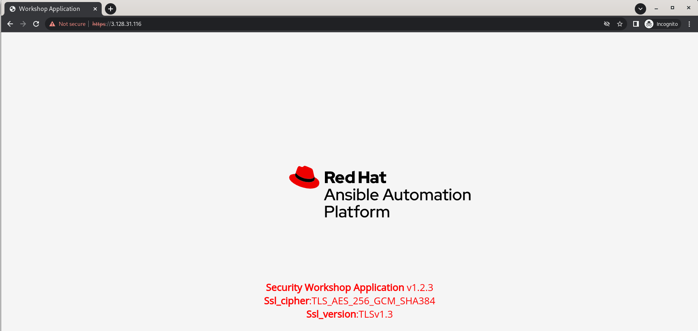

> **Tip**
>
> The insecure warning your browser will show is due to the fact that we are using a self signed certificate that cannot be validated. In real environments real certificates would be used that can be validated and thus will not show the warning.

We are almost done, as the application can still be reachable over http as well as https, we need to redircet all http requests to https. For the last time, lets add some tasks to the `Configure SSL for apache` play in our playbook in the `tasks` section:

``` yaml
  - name: Enable the mod_rewrite Apache module 
    community.general.apache2_module:
      state: present
      name: rewrite
      ignore_configcheck: True
    notify: restart apache

  - name: Configure http redirect
    ansible.builtin.blockinfile:
      path: "{{ apache_config_file }}"
      insertafter: "## SSL Virtual Host Context"
      block: |
        <VirtualHost *:80>
        RewriteEngine On
        RewriteCond %{HTTPS} off
        RewriteRule (.*) https://%{SERVER_NAME}
        </VirtualHost>
    notify: restart apache
```

The final tasks will use the `apache2_module` from the `community.general` collection to make sure that the Apache module `mod_rewrite` is enabled, and then use the `ansible.builtin.blockinfile` to make an entry in the Apache SSL configuration file to redirect all the http traffic to https.

The Final play book will look like this:

``` yaml
---
- name: Configure SSL on mysql
  hosts: "{{ mariadb_host }}"
  gather_facts: False
  vars_files: vars/ssl-vars.yml
  tags: 
  - mysql
  become: True
  tasks:
     
  - name: Make sure that the directory to hold keys and certs exist
    ansible.builtin.file:
      path: "{{ mariadb_certs_path }}"
      state: directory

  - name: Generate a new 2048 bit key
    community.crypto.openssl_privatekey:
      path: "{{ mariadb_certs_path }}/{{ mariadb_ca_key_name }}"
      size: 2048
      group: "{{ mariadb_system_user }}"
      owner: "{{ mariadb_system_group }}"
      mode: 0660
    register: ca_key

  - name: Create certificate signing request (CSR) for CA certificate
    community.crypto.openssl_csr_pipe:
      privatekey_path: "{{ ca_key.filename }}"
      common_name: "{{ inventory_hostname }}"
      use_common_name_for_san: false  
      basic_constraints:
        - 'CA:TRUE'
    register: ca_csr

  - name: Create The CA self-signed certificate
    community.crypto.x509_certificate:
      path: "{{ mariadb_certs_path }}/{{ mariadb_ca_cert_name }}"
      csr_content: "{{ ca_csr.csr }}"
      privatekey_path: "{{ ca_key.filename }}"
      provider: selfsigned
      group: "{{ mariadb_system_user }}"
      owner: "{{ mariadb_system_group }}"
      mode: 0660
    register: ca_crt

  - name: Create the private key for the server
    community.crypto.openssl_privatekey:
      path: "{{ mariadb_certs_path }}/{{ mariadb_server_key_name }}"
      size: 2048
      group: "{{ mariadb_system_user }}"
      owner: "{{ mariadb_system_group }}"
      mode: 0660
    register: server_key

  - name: Create certificate signing request  for Server certificate
    community.crypto.openssl_csr_pipe:
      privatekey_path: "{{ server_key.filename }}"
      common_name: "{{ inventory_hostname }}.example.com"
      use_common_name_for_san: false  
    register: server_csr

  - name: Sign thethe CSR for the server
    community.crypto.x509_certificate:
      path: "{{ mariadb_certs_path }}/{{ mariadb_server_cert_name }}"
      csr_content:  "{{ server_csr.csr }}"
      provider: ownca
      ownca_path: "{{ ca_crt.filename }}"
      ownca_privatekey_path: "{{ ca_key.filename }}"
      group: "{{ mariadb_system_user }}"
      owner: "{{ mariadb_system_group }}"
      mode: 0660
    register: ca_crt

  - name: Configure custom port and remote listening and enable SSL
    ansible.builtin.blockinfile:
      path: "{{ mariadb_config_file }}"
      insertafter: "[mysqld]"
      block: |
        #BIND ADDRESS AND PORT
        bind-address=0.0.0.0
        port=3389
        #SSL CONFIG
        ssl-ca={{ mariadb_certs_path }}/{{ mariadb_ca_cert_name }}
        ssl-cert={{ mariadb_certs_path }}/{{ mariadb_server_cert_name }}
        ssl-key={{ mariadb_certs_path }}/{{ mariadb_server_key_name }}
    notify:
    - restart mysql

  - name: Read the generated password
    ansible.builtin.slurp:
      src: "{{ mysql_db_password_file }}"
    register: mysql_password

  - name: Setting host facts for the mysql password
    ansible.builtin.set_fact:
      webapp_password: "{{ mysql_password['content'] | b64decode | trim }}"

  - name: Read the generated ca-cert.pem file
    ansible.builtin.slurp:
      src: "{{ mariadb_certs_path }}/{{ mariadb_ca_cert_name }}"
    register: cacert

  - name: Setting host facts for the CA cert
    ansible.builtin.set_fact:
      cacert_contents: "{{ cacert['content'] | b64decode | trim }}"

  - name: Modifying the Application DB User to require SSL
    community.mysql.mysql_user:
      login_host: localhost
      login_port: "{{ mariadb_port }}"
      login_user: root
      login_password: "{{ webapp_password }}"
      name: "{{ mariadb_username }}"
      host: '%'
      password: "{{ webapp_password }}"
      priv: '*.*:ALL'
      tls_requires:
        ssl:
      state: present

  handlers:
  - name: restart mysql
    ansible.builtin.service:
      name: mariadb
      state: restarted
      enabled: True  

- name: Configure SSL for apache
  hosts: "{{ apache_host }}"
  gather_facts: False
  vars_files: vars/ssl-vars.yml
  tags: 
  - apache
  become: True
  tasks:
  - name: Create a file with the contents of the ca cert generated on the mariaDB host
    ansible.builtin.copy:
      content: "{{ hostvars[mariadb_host]['cacert_contents'] }}"
      dest: "{{ apache_host_docroot }}/{{ mariadb_ca_cert_name }}"
      
  - name: copy vars php template
    ansible.builtin.template:
      src: templates/dbvars.php.j2
      dest: "{{ apache_host_docroot }}/dbvars.php"

  - name: Install mod_ssl 
    ansible.builtin.dnf:
      name: mod_ssl
      state: latest
    notify: restart apache

  - name: Create directory to hold Apache key and cert
    ansible.builtin.file:
      path: "{{ apache_certs_path }}"
      state: directory

  - name: Create the private key (4096 bits)
    community.crypto.openssl_privatekey:
      path: "{{ apache_certs_path }}/certificate.key"
      size: 4096

  - name: Create a self-signed certificate
    community.crypto.x509_certificate:
      path: "{{ apache_certs_path }}/certificate.cert"
      privatekey_path: "{{ apache_certs_path }}/certificate.key"
      provider: selfsigned

  - name: change SELinux context on cert and key file
    community.general.sefcontext:
      target: "{{ item }}"
      setype: cert_t
    loop:
    - "{{ apache_certs_path }}/certificate.key"
    - "{{ apache_certs_path }}/certificate.cert"
   
  - name: Apply new SELinux file context to filesystem
    ansible.builtin.command: restorecon -irv "{{ apache_certs_path }}/"

  - name: edit the ssl configuration file to point to the generated certificate
    ansible.builtin.lineinfile:
      path: "{{ apache_config_file }}"
      regexp: '^SSLCertificateFile'
      line: SSLCertificateFile {{ apache_certs_path }}/certificate.cert
    notify: restart apache

  - name: edit the ssl configuration file to point to the generated key
    ansible.builtin.lineinfile:
      path: "{{ apache_config_file }}"
      regexp: '^SSLCertificateKeyFile'
      line: SSLCertificateKeyFile {{ apache_certs_path }}/certificate.key
    notify: restart apache
    
  - name: ensure that apache is running and enabled for idempotency
    ansible.builtin.service:
      name: httpd
      state: started
      enabled: True  
  
  - name: Enable the mod_rewrite Apache module 
    community.general.apache2_module:
      state: present
      name: rewrite
      ignore_configcheck: True
    notify: restart apache

  - name: Configure http redirect
    ansible.builtin.blockinfile:
      path: "{{ apache_config_file }}"
      insertafter: "## SSL Virtual Host Context"
      block: |
        <VirtualHost *:80>
        RewriteEngine On
        RewriteCond %{HTTPS} off
        RewriteRule (.*) https://%{SERVER_NAME}
        </VirtualHost>
    notify: restart apache

  handlers:
  - name: restart apache
    ansible.builtin.service:
      name: httpd
      state: restarted
      enabled: True   
```
For the last time in this section, commit and push your playbook to github. Back in Automation Controller , go to templates and click the  icon next to your `SSL Setup` Job Template and wait for the Job to finish. Now go to the URL for `node` over http using the URL `http://<NODE1's_IP_ADDRESS>` and you should get redirected to https.


We now have a playbook that can consistantly apply the requirements laid out by the security team in an automated way, **HOORAY!**

# Section 3: DETECT

With the security team's requirements met, we can now forget about the application and the database right? 
Absolutely not! While security incidents do originate from initial misconfiguration, they also can be due to the configuration *changing* over time,  whether due to unintentional changes or purposeful malicious intent. So how do you make sure that your configurations match your policies?

**Good news! Ansible can still help in multiple ways.**

One of the ways relies on the idempotency of Ansible Playbooks (if idempotent modules are used), and works by running your configuration Job templates from Automation Controller in `check` mode (which reports changes by tasks that will infact make a change to the system state without making the change) on a schedule, and configuring Automation Controller to an external log aggregator. Using the indexed job logs, reports could then be created that displays the information on systems that will have changes applied to them, indicating their drift.

Another way is relying on Jinja2 templates to generate a custom report that can be emailed, stored in a certain location, deployed as a webpage or many other ways to show the state of the systems with respect to our required configurations. This is the approach we will explore in this workshop.

## Step 1 - Generating a compliance report: writing the playbook

To monitor the state of our security configuration, we will write a playbook that will collect information from all of our nodes that relates to our security requirements, and generate a report to show the compliance state. The playbook will collect information on the MariaDB SSL configuration, The Apache SSL configuration, the status of the HTTP redirect and other relevant information. And since we already (handily) have Apache deployed on a couple of nodes, we will use the same nodes to display an HTML report with that information.

Going back to our Project, create a new file in the root of the project called `generate-status-report.yml`. Your directory structure should look like this:

```
.
├── collections
│   └── requirements.yml
├── generate-status-report.yml
├── setup-ssl.yml
├── templates
│   ├── dbvars.php.j2
└── vars
    └── ssl-vars.yml
```

In the `generate-status-report.yml` playbook, place the following code:

```yaml
---
- name: Gather infomation from MariaDB hosts
  hosts: "{{ mariadb_host }}"
  gather_facts: False
  vars_files: vars/ssl-vars.yml
  become: True
  tasks:
  - name: Check if a CA cert is still valid
    community.crypto.x509_certificate_info:
      path: "{{ mariadb_certs_path }}/{{ mariadb_ca_cert_name }}"
    register: ca_cert_valid

  - name: Check if a MariaDB Server cert is still valid
    community.crypto.x509_certificate_info:
      path: "{{ mariadb_certs_path }}/{{ mariadb_server_cert_name }}"
    register: server_cert_valid

  - name: Check if a CA cert is still valid
    ansible.builtin.command: openssl verify -CAfile {{ mariadb_ca_cert_name }} {{ mariadb_server_cert_name }}
    args:
      chdir: "{{ mariadb_certs_path }}"
    register: openssl_verify_result
    changed_when: False
  
  - name: Check for MariaDB Bind Address
    ansible.builtin.lineinfile:
      path: "{{ mariadb_config_file }}"
      regexp: '^bind-address='
      line: 'bind-address=0.0.0.0'
    check_mode: True
    register: mariadb_cfg_bind_address  

  - name: Check for MariaDB Port
    ansible.builtin.lineinfile:
      path: "{{ mariadb_config_file }}"
      regexp: '^port='
      line: 'port=3389'
    check_mode: True
    register: mariadb_cfg_listen_port  

  - name: Check for MariaDB CA Config
    ansible.builtin.lineinfile:
      path: "{{ mariadb_config_file }}"
      regexp: '^ssl-ca='
      line: ssl-ca={{ mariadb_certs_path }}/{{ mariadb_ca_cert_name }}
    check_mode: True
    register: mariadb_cfg_ca_cert  

  - name: Check for MariaDB Server Key Config
    ansible.builtin.lineinfile:
      path: "{{ mariadb_config_file }}"
      regexp: '^ssl-key='
      line: ssl-key={{ mariadb_certs_path }}/{{ mariadb_server_key_name }}
    check_mode: True
    register: mariadb_cfg_server_key 

  - name: Check for MariaDB Server Cert Config
    ansible.builtin.lineinfile:
      path: "{{ mariadb_config_file }}"
      regexp: '^ssl-cert='
      line: ssl-cert={{ mariadb_certs_path }}/{{ mariadb_server_cert_name }}
    check_mode: True
    register: mariadb_cfg_server_cert 

  - name: Read the generated password
    ansible.builtin.slurp:
      src: "{{ mysql_db_password_file }}"
    register: mysql_password

  - name: Setting host facts for the mysql password
    ansible.builtin.set_fact:
      webapp_password: "{{ mysql_password['content'] | b64decode | trim }}"

  - name: DB User requiring SSL
    community.mysql.mysql_user:
      login_host: localhost
      login_port: "{{ mariadb_port }}"
      login_user: root
      login_password: "{{ webapp_password }}"
      name: "{{ mariadb_username }}"
      host: '%'
      password: "{{ webapp_password }}"
      priv: '*.*:ALL'
      tls_requires:
        ssl:
      state: present
    check_mode: True
    register: dbuser_requires_ssl

  - name: Check SSL version 
    community.mysql.mysql_query:
      login_host: "{{ mariadb_host }}.example.com"
      login_port: 3389
      login_user: webapp
      login_password: "{{ webapp_password }}"
      login_db: webapp_db
      ca_cert: "{{ mariadb_certs_path }}/{{ mariadb_ca_cert_name }}"
      query:
      - SHOW SESSION STATUS WHERE Variable_name IN ('Ssl_version');
      single_transaction: yes
    register: ssl_version_check

  - name: Check SSL Cipher 
    community.mysql.mysql_query:
      login_host: "{{ mariadb_host }}.example.com"
      login_port: 3389
      login_user: webapp
      login_password: "{{ webapp_password }}"
      login_db: webapp_db
      ca_cert: "{{ mariadb_certs_path }}/{{ mariadb_ca_cert_name }}"
      query:
      - SHOW SESSION STATUS WHERE Variable_name IN ('Ssl_cipher');
      single_transaction: yes
    register: ssl_cipher_check

  - name: Setting Facts for collected information
    ansible.builtin.set_fact:
      openssl_verify_result: "{{ openssl_verify_result }}"
      ca_cert_valid: "{{ ca_cert_valid }}"
      server_cert_valid: "{{ server_cert_valid }}"
      mariadb_cfg_bind_address: "{{ mariadb_cfg_bind_address }}"
      mariadb_cfg_listen_port: "{{ mariadb_cfg_listen_port }}"
      mariadb_cfg_ca_cert: "{{ mariadb_cfg_ca_cert }}"
      mariadb_cfg_server_key: "{{ mariadb_cfg_server_key }}"
      mariadb_cfg_server_cert: "{{ mariadb_cfg_server_cert }}"
      dbuser_requires_ssl: "{{ dbuser_requires_ssl }}"
      ssl_version_check: "{{ ssl_version_check }}"
      ssl_cipher_check: "{{ ssl_cipher_check }}"

- name: Gather infomation from Apache hosts
  hosts: "{{ apache_host }}"
  gather_facts: False
  vars_files: vars/ssl-vars.yml
  become: True
  tasks:    
  - name: Check that you can connect (GET) to a page and it returns a status 200
    ansible.builtin.uri:
      url: http://{{ ansible_host }} 
      validate_certs: False
    register: http_stat
      
  - name: Check that you can connect (GET) to a page and it returns a status 200
    ansible.builtin.uri:
      url: https://{{ ansible_host }} 
      validate_certs: False
    register: https_stat
    
  - name: Setting Facts for collected information
    ansible.builtin.set_fact:
      http_stat: "{{ http_stat }}"
      https_stat: "{{ https_stat }}"

- name: Generate and Deploy the Report
  hosts: all
  gather_facts: True
  vars_files: vars/ssl-vars.yml
  become: True
  tasks:
  - name: Deploy the report html template
    ansible.builtin.template:
      src: report.html.j2
      dest: /var/www/html/report.html
    delegate_to: "{{ item }}"
    loop: "{{ apache_host }}"
    run_once: True
```

The playbook we just created has 3 plays:
1. The first play `Gather infomation from MariaDB hosts` Runs on the MariaDB host, and collects information related to the MariaDB generated certificates and the application database user:
  * we use the `x509_certificate_info` module from the `community.crypto` collection to gather informaion on the generated certificates.
  *  we use the `ansible.builtin.command` module to issue the `openssl verify` command to validate the generated server certificate.
  * we use the `ansible.builtin.lineinfile` to check for certain configurations in configuration files.
  * we use the `mysql_user` module from the `community.mysql` collection to check the database user and the requirement to use encrypted connections.
  * we use the `mysql_query` module from the `community.mysql` collection to run a query with the database user and certificate to check the SSL Version and SSL Cipher.
  * Finally we set host facts with the collected information.
2. The second play `Gather infomation from Apache hosts` Runs on the Apache hosts, and collects information related to the SSL configuraion for Apache, as well as the HTTP to HTTPS redirect:
   * we use the `ansible.builtin.uri` module to check the status of the HTTP and HTTP requests, and that the redirect is set up correctly on the Apache nodes.
    * Finally we set host facts with the collected information.
3. The final play `Generate and Deploy the Report` runs on all the hosts, and gathers Facts from all hosts, and generates the report using the `ansible.builtin.template` module and a template file we will create next, and deploys that report to the Apache hosts so that we may access that report as a webpage.

we then need to create the template file that will be used to generate the report. In the `templates` directory, create a file names `report.html.j2`. The project directory structure should now look like this:

```
.
├── collections
│   └── requirements.yml
├── generate-status-report.yml
├── setup-ssl.yml
├── templates
│   ├── dbvars.php.j2
│   └── report.html.j2
└── vars
    └── ssl-vars.yml
```
In the `report.html.j2` file place the following content:

```html
<html lang="en">
   <head>
      <meta charset="utf-8">
      <title>Application/Database Compliance Check Report</title>
      <style>
         p.hostname {
         color: #000000;
         font-weight: bolder;
         font-size: large;
         margin: auto;
         width: 50%;
         }
         #subtable {
         background: #ebebeb;
         margin: 0px;
         width: 100%;
         }
         #subtable tbody tr td {
         padding: 5px 5px 5px 5px;
         }
         #subtable thead th {
         padding: 5px;
         }
         * {
         -moz-box-sizing: border-box;
         -webkit-box-sizing: border-box;
         box-sizing: border-box;
         font-family: "Open Sans", "Helvetica";
         }
         a {
         color: #ffffff;
         }
         p {
         color: #ffffff;
         }
         h1 {
         text-align: center;
         color: #ffffff;
         }
         body {
         background:#999999;
         padding: 0px;
         margin: 0px;
         font-family: "Helvetica Neue", Helvetica, Arial, sans-serif;
         }
         table {
         border-collapse: separate;
         background:#fff;
         @include border-radius(5px);
         @include box-shadow(0px 0px 5px rgba(0,0,0,0.3));
         }
         .main_net_table {
         margin:50px auto;
         }
         .main_net_table {
         margin:50px auto;
         }
         thead {
         @include border-radius(5px);
         }
         thead th {
         font-size:16px;
         font-weight:400;
         color:#fff;
         @include text-shadow(1px 1px 0px rgba(0,0,0,0.5));
         text-align:left;
         padding:20px;
         border-top:1px solid #858d99;
         background: #353a40;
         &:first-child {
         @include border-top-left-radius(5px);
         }
         &:last-child {
         @include border-top-right-radius(5px);
         }
         }
         tbody tr td {
         font-weight:400;
         color:#5f6062;
         font-size:13px;
         padding:20px 20px 20px 20px;
         border-bottom:1px solid #e0e0e0;
         }
         tbody tr:nth-child(2n) {
         background:#f0f3f5;
         }
         tbody tr:last-child td {
         border-bottom:none;
         &:first-child {
         @include border-bottom-left-radius(5px);
         }
         &:last-child {
         @include border-bottom-right-radius(5px);
         }
         }
         td {
         vertical-align: top;
         }
         span.highlight {
         background-color: yellow;
         }
         .expandclass {
         color: #5f6062;
         }
         .content{
         display:none;
         margin: 10px;
         }
         header {
         width: 100%;
         position: initial;
         float: initial;
         padding: 0;
         margin: 0;
         border-radius: 0;
         height: 88px;
         background-color: #171717;
         align-items: center;
         }
         .header-container {
         margin: 0 auto;
         padding: 5px 0;
         text-align: center;
         width: 100%;
         height: 100%;
         }
         .header-logo {
         width: 137px;
         border: 0;
         margin: 0;
         margin-left: 15px;
         }
         .header-link {
         margin-left: 40px;
         text-decoration: none;
         cursor: pointer;
         text-transform: uppercase;
         font-size: 15px;
         font-family: 'Red Hat Text';
         font-weight: 500;
         }
         .header-link:hover {
         text-shadow: 0 0 0.02px white;
         text-decoration: none;
         }
         table.net_info td {
         padding: 5px;
         }
         p.expandclass:hover {
         text-decoration: underline;
         color: #EE0000;
         cursor: pointer;
         }
         .summary_info {
         }
         .ui-state-active, .ui-widget-content .ui-state-active, .ui-widget-header .ui-state-active, a.ui-button:active, .ui-button:active, .ui-button.ui-state-active:hover {
         border: 1px solid #5F0000;
         background: #EE0000;
         }
         div#net_content {
         padding: 0px;
         height: auto !important;
         }
         img.router_image {
         vertical-align: middle;
         padding: 0px 10px 10px 10px;
         width: 50px;
         }
         table.net_info {
         width: 100%;
         }
         p.internal_label {
         color: #000000;
         }
      </style>
      <link href='https://fonts.googleapis.com/css?family=Open+Sans' rel='stylesheet' type='text/css'>
      <script src="https://ajax.googleapis.com/ajax/libs/jquery/1.11.2/jquery.min.js"></script>  
      <script type="text/javascript">  
         $(document).ready(function () {  
                 $('tr.parent')  
                     .css("cursor", "pointer")  
                     .attr("title", "Click to expand/collapse")  
                     .click(function () {  
                         $(this).siblings('.child-' + this.id).toggle();  
                     });  
                 $('tr[@class^=child-]').hide().children('td');  
         });  
      </script>  
   </head>
   <body>
      <div class="wrapper">
         <header>
            <div class="header-container">
               <h1>Application/Database Compliance Check Report</h1>
            </div>
         </header>
         <section>
            <div id="accordion">
               <table class="main_net_table" id="detail_table" style="width:70%">
                  <thead>
                     <tr>
                        <th style="width:20%">Host</th>
                        <th style="width:20%">FQDN </th>
                        <th style="width:20%">OS</th>
                        <th style="width:20%">OS Version</th>
                        <th style="width:20%">kernel</th>
                     </tr>
                  </thead>
                  <tbody>
                     
                     
                     <tr class="parent" id="{{ host | replace(".", "") }}" title="Click to expand/collapse" style="cursor: pointer;"> 
                     <td>{{ host }}</td>
                     <td>{{ hostvars[host].ansible_fqdn }}</td>
                     <td>{{ hostvars[host].ansible_distribution }}</td>
                     <td>{{ hostvars[host].ansible_distribution_version }}</td>
                     <td>{{ hostvars[host].ansible_kernel }}</td>
                     </tr>
                     <!--MariaDB Hosts Values-->                     
                     
                     <tr class="child-{{ host | replace(".", "") }}" style="display: table-row;">
                     <td style="text-align: left;"><strong>MariaDB Host</strong></td>
                     <td></td>
                     <td style="text-align: left;"><strong>Check</strong></td>
                     <td style="text-align: left;"><strong>Configured</strong></td>
                     <td style="text-align: center;"><strong>Compliant</strong></td>
                     </tr>
                     <!--CA Cert Common Name-->
                     <tr class="child-{{ host | replace(".", "") }}" style="display: table-row;">
                     <td></td>
                     <td></td>
                     <td style="text-align: left;">CA Cert common Name</td>
                     <td style="text-align: left;">{{ hostvars[host].ca_cert_valid.subject.commonName }}</td>
                     
                     <td style="text-align: center; vertical-align: middle;">&#9989;</td>
                     
                     <td style="text-align: center; vertical-align: middle;">&#10060;</td>
                     
                     </tr>
                     <!--CA Cert Expiry status-->
                     <tr class="child-{{ host | replace(".", "") }}" style="display: table-row;">
                     <td></td>
                     <td></td>
                     <td style="text-align: left;">CA Cert Expired</td>
                     <td style="text-align: left;">{{ hostvars[host].ca_cert_valid.expired }}</td>
                     
                     <td style="text-align: center; vertical-align: middle;">&#9989;</td>
                     
                     <td style="text-align: center; vertical-align: middle;">&#10060;</td>
                     
                     </tr>
                     <!--Server Cert Common Name-->
                     <tr class="child-{{ host | replace(".", "") }}" style="display: table-row;">
                     <td></td>
                     <td></td>
                     <td style="text-align: left;">Server Cert common Name</td>
                     <td style="text-align: left;">{{ hostvars[host].server_cert_valid.subject.commonName }}</td>
                     
                     
                     <td style="text-align: center; vertical-align: middle;">&#9989;</td>
                     
                     <td style="text-align: center; vertical-align: middle;">&#10060;</td>
                     
                     </tr>
                     <!--Server Cert Expiry status-->
                     <tr class="child-{{ host | replace(".", "") }}" style="display: table-row;">
                     <td></td>
                     <td></td>
                     <td style="text-align: left;">Server Cert Expired</td>
                     <td style="text-align: left;">{{ hostvars[host].server_cert_valid.expired }}</td>
                     
                     <td style="text-align: center; vertical-align: middle;">&#9989;</td>
                     
                     <td style="text-align: center; vertical-align: middle;">&#10060;</td>
                     
                     </tr>
                     <!--Verify The Server Cert-->
                     <tr class="child-{{ host | replace(".", "") }}" style="display: table-row;">
                     <td></td>
                     <td></td>
                     <td style="text-align: left;">Server Cert Verify</td>
                     <td style="text-align: left;">{{ hostvars[host].openssl_verify_result.stdout }}</td>
                     
                     <td style="text-align: center; vertical-align: middle;">&#9989;</td>
                     
                     <td style="text-align: center; vertical-align: middle;">&#10060;</td>
                     
                     </tr>
                     <!--MariaDB Bind Address-->
                     <tr class="child-{{ host | replace(".", "") }}" style="display: table-row;">
                     <td></td>
                     <td></td>
                     <td style="text-align: left;">MariaDB Bind Address</td>
                     <td style="text-align: left;">{{ not hostvars[host].mariadb_cfg_bind_address.changed }}</td>
                     
                     <td style="text-align: center; vertical-align: middle;">&#9989;</td>
                     
                     <td style="text-align: center; vertical-align: middle;">&#10060;</td>
                     
                     </tr>
                     <!--MariaDB Port-->
                     <tr class="child-{{ host | replace(".", "") }}" style="display: table-row;">
                     <td></td>
                     <td></td>
                     <td style="text-align: left;">MariaDB Port</td>
                     <td style="text-align: left;">{{ not hostvars[host].mariadb_cfg_listen_port.changed }}</td>
                     
                     <td style="text-align: center; vertical-align: middle;">&#9989;</td>
                     
                     <td style="text-align: center; vertical-align: middle;">&#10060;</td>
                     
                     </tr>
                     <!--MariaDB CA Cert Configuration-->
                     <tr class="child-{{ host | replace(".", "") }}" style="display: table-row;">
                     <td></td>
                     <td></td>
                     <td style="text-align: left;">MariaDB CA Cert Configuration</td>
                     <td style="text-align: left;">{{ not hostvars[host].mariadb_cfg_ca_cert.changed }}</td>
                     
                     <td style="text-align: center; vertical-align: middle;">&#9989;</td>
                     
                     <td style="text-align: center; vertical-align: middle;">&#10060;</td>
                     
                     </tr>
                     <!--MariaDB Server Key Configuration-->
                     <tr class="child-{{ host | replace(".", "") }}" style="display: table-row;">
                     <td></td>
                     <td></td>
                     <td style="text-align: left;">MariaDB Server Key Configuration</td>
                     <td style="text-align: left;">{{ not hostvars[host].mariadb_cfg_server_key.changed }}</td>
                     
                     <td style="text-align: center; vertical-align: middle;">&#9989;</td>
                     
                     <td style="text-align: center; vertical-align: middle;">&#10060;</td>
                     
                     </tr>
                     <!--MariaDB Server Cert Configuration-->
                     <tr class="child-{{ host | replace(".", "") }}" style="display: table-row;">
                     <td></td>
                     <td></td>
                     <td style="text-align: left;">MariaDB Server Cert Configuration</td>
                     <td style="text-align: left;">{{ not hostvars[host].mariadb_cfg_server_cert.changed }}</td>
                     
                     <td style="text-align: center; vertical-align: middle;">&#9989;</td>
                     
                     <td style="text-align: center; vertical-align: middle;">&#10060;</td>
                     
                     </tr>
                     <!--MariaDB Server DB User SSL Configuration-->
                     <tr class="child-{{ host | replace(".", "") }}" style="display: table-row;">
                     <td></td>
                     <td></td>
                     <td style="text-align: left;">MariaDB User SSL Configuration</td>
                     <td style="text-align: left;">{{ not hostvars[host].dbuser_requires_ssl.changed }}</td>
                     
                     <td style="text-align: center; vertical-align: middle;">&#9989;</td>
                     
                     <td style="text-align: center; vertical-align: middle;">&#10060;</td>
                     
                     </tr>
                     <!--MariaDB Server DB User SSL Version Info-->
                     <tr class="child-{{ host | replace(".", "") }}" style="display: table-row;">
                     <td></td>
                     <td></td>
                     <td style="text-align: left;">MariaDB User SSL Version</td>
                     <td style="text-align: left;">{{ hostvars[host].ssl_version_check.query_result[0][0].Value }}</td>
                     
                     <td style="text-align: center; vertical-align: middle;">&#9989;</td>
                     
                     <td style="text-align: center; vertical-align: middle;">&#10060;</td>
                     
                     </tr>
                     <!--MariaDB Server DB User SSL Cipher Info-->
                     <tr class="child-{{ host | replace(".", "") }}" style="display: table-row;">
                     <td></td>
                     <td></td>
                     <td style="text-align: left;">MariaDB User SSL Cipher</td>
                     <td style="text-align: left;">{{ hostvars[host].ssl_cipher_check.query_result[0][0].Value }}</td>
                     
                     <td style="text-align: center; vertical-align: middle;">&#9989;</td>
                     
                     <td style="text-align: center; vertical-align: middle;">&#10060;</td>
                     
                     </tr>

                     <!--Apache Hosts Values-->                     
                     
                     <tr class="child-{{ host | replace(".", "") }}" style="display: table-row;">
                     <td style="text-align: left;"><strong>Apache Host</strong></td>
                     <td></td>
                     <td style="text-align: left;"><strong>Check</strong></td>
                     <td style="text-align: left;"><strong>Configured</strong></td>
                     <td style="text-align: center;"><strong>Compliant</strong></td>
                     </tr>
                     <!--Apache HTTP Redirect-->
                     <tr class="child-{{ host | replace(".", "") }}" style="display: table-row;">
                     <td></td>
                     <td></td>
                     <td style="text-align: left;">HTTP Redirect to HTTPS</td>
                     <td style="text-align: left;">{{ hostvars[host].http_stat.redirected }}</td>
                     
                     <td style="text-align: center; vertical-align: middle;">&#9989;</td>
                     
                     <td style="text-align: center; vertical-align: middle;">&#10060;</td>
                     
                     </tr>
                     <!--Apache Server Info-->
                     <tr class="child-{{ host | replace(".", "") }}" style="display: table-row;">
                     <td></td>
                     <td></td>
                     <td style="text-align: left;">Apache Server Info</td>
                     <td style="text-align: left;">{{ hostvars[host].https_stat.server }}</td>
                     
                     <td style="text-align: center; vertical-align: middle;">&#9989;</td>
                     
                     <td style="text-align: center; vertical-align: middle;">&#10060;</td>
                     
                     </tr>
                     <!--Apache HTTP Return status-->
                     <tr class="child-{{ host | replace(".", "") }}" style="display: table-row;">
                     <td></td>
                     <td></td>
                     <td style="text-align: left;">Http Return Status</td>
                     <td style="text-align: left;">{{ hostvars[host].http_stat.status }}</td>
                     
                     <td style="text-align: center; vertical-align: middle;">&#9989;</td>
                     
                     <td style="text-align: center; vertical-align: middle;">&#10060;</td>
                     
                     </tr>
                     <!--Apache HTTPS Return status-->
                     <tr class="child-{{ host | replace(".", "") }}" style="display: table-row;">
                     <td></td>
                     <td></td>
                     <td style="text-align: left;">Https Return Status</td>
                     <td style="text-align: left;">{{ hostvars[host].https_stat.status }}</td>
                     
                     <td style="text-align: center; vertical-align: middle;">&#9989;</td>
                     
                     <td style="text-align: center; vertical-align: middle;">&#10060;</td>
                     
                     </tr>
                     
                     
                     
                  </tbody>
               </table>
            </div>
            <br>
            
            <center><a href="https://ansible.com"> </a></center>
         </section>
      </div>
   </body>
</html>
```
Save all files then commit and push your changes to github.

## Step 2 - Generating a compliance report: running the playbook

Back in Automation Controller, click **Projects** and click on the  icon next to your `Security Workshop Project`. Wait until the project refresh finishes, then select **Templates** and click on the  icon, and select `Add Job Template`. Use the following values for your new Template:

| Key         | Value                                            | Note |
|-------------|--------------------------------------------------|------|
| Name        | Generate and Deploy Report                           |      |
| Description | Generate and Deploy a Report on the Apache and MariaDB compliance  |      |
| Job Type    | Run                                              |      |
| Inventory   | Workshop Inventory                               |      |
| Project     | Security Workshop Project                            |      |
| Execution Environment | rhel workshop execution environment             |      |
| Playbook    | `generate-status-report.yml`                |      |
| Credential  | Type: **Machine**. Name: **Workshop Credential**     |      |
| Limit       | web                                          |      |
| Options     |                                                  |      |

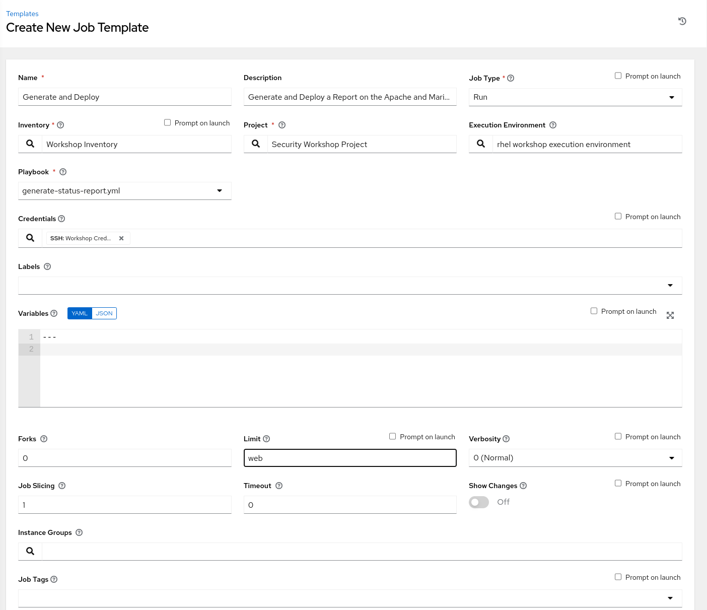

Click SAVE and then Click LAUNCH to run the job. The job will start running. Once the Job run completes, the reports are now accessible on the Apache servers at `https://<NODE1's_IP_ADDRESS>/report.html` 

## Step 3 - Generating a compliance report: Inspecting the report

Visiting the URL `https://<NODE1's_IP_ADDRESS>/report.html` or `https://<NODE2's_IP_ADDRESS>/report.html` will display a report that looks like this:

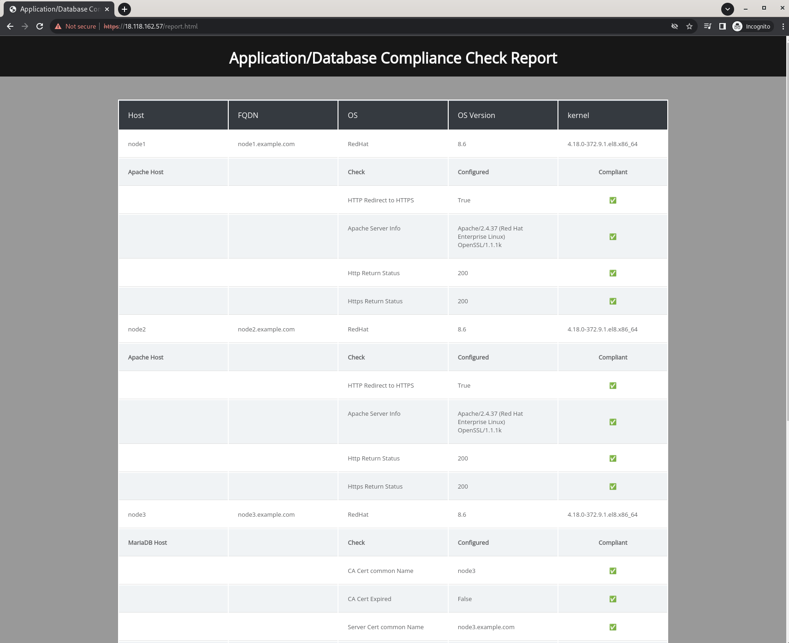

The report shows common information for all nodes from the facts gathered by Ansible like the OS, OS version and Kernel Version. Clicking on each host will collapse or expand its specific compliance information. For each node, it shows the node's usage, as well as the Application/Database specific compliance information. Everything should be Compliant as we just finished Securing our LAMP stack.
Take a minute to inspect all the information on the report.

Practically speaking, the Job template to scan the systems and generate the report could be scheduled to run hourly, daily or on any frequency from the Automation Controller. This allows us to have a report that refreshes regulary so that we could be informed on how we are doing with regards to our security requirements.

## Step 4 - Generating a compliance report: Introducing Drift

Let us now introduce some changes to our systems to simulate unwanted changes that may be un intended or malicious. There is a playbook already written and provided in the `Initial Setup Project` to do just that, make some `"changes"` to our configurations.

In Automation Controller, Select **Templates** and click on the  icon, and select `Add Job Template`. Use the following values for your new Template:

| Key         | Value                                            | Note |
|-------------|--------------------------------------------------|------|
| Name        | Workshop Simulate Drift                          |      |
| Description | Simulating Drift in our systems                  |      |
| Job Type    | Run                                              |      |
| Inventory   | Workshop Inventory                               |      |
| Project     | Initial Setup Project                            |      |
| Execution Environment | rhel workshop execution environment    |      |
| Playbook    | `lab-simulate-drift.yml`                         |      |
| Credential  | Type: **Machine**. Name: **Workshop Credential** |      |
| Limit       | web                                              |      |
| Options     | None Selected                                    |      |


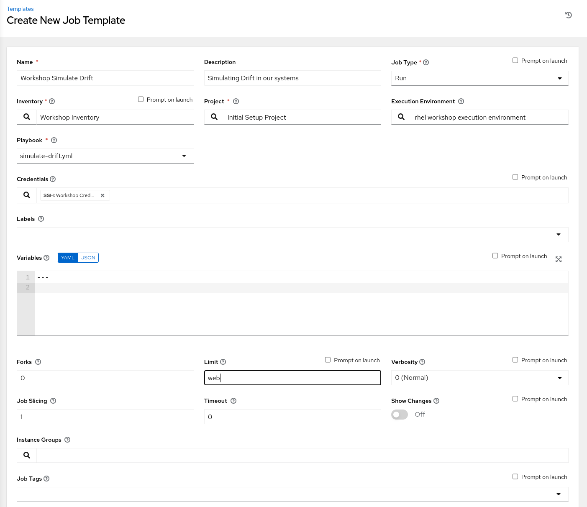

Click SAVE and then Click LAUNCH to run the job. The job will start running. Once the Job run completes, Go to your web servers URLs to access the application. Things will look quite normal - maybe you see one issue or maybe not.

> **Tip**
>
> Inspecting the output of the `Workshop Simulate Drift` job will show exactly what broke in our configuration, so it is suggested that you do not read the output of the job while its running.

Now go back and re-run the `Generate and Deploy Report` Job template. Once the Job run completes, the New reports are now deployed on the Apache servers. Load or refresh either URL (`https://<NODE1's_IP_ADDRESS>/report.html` or `https://<NODE2's_IP_ADDRESS>/report.html`) and inspect the output:

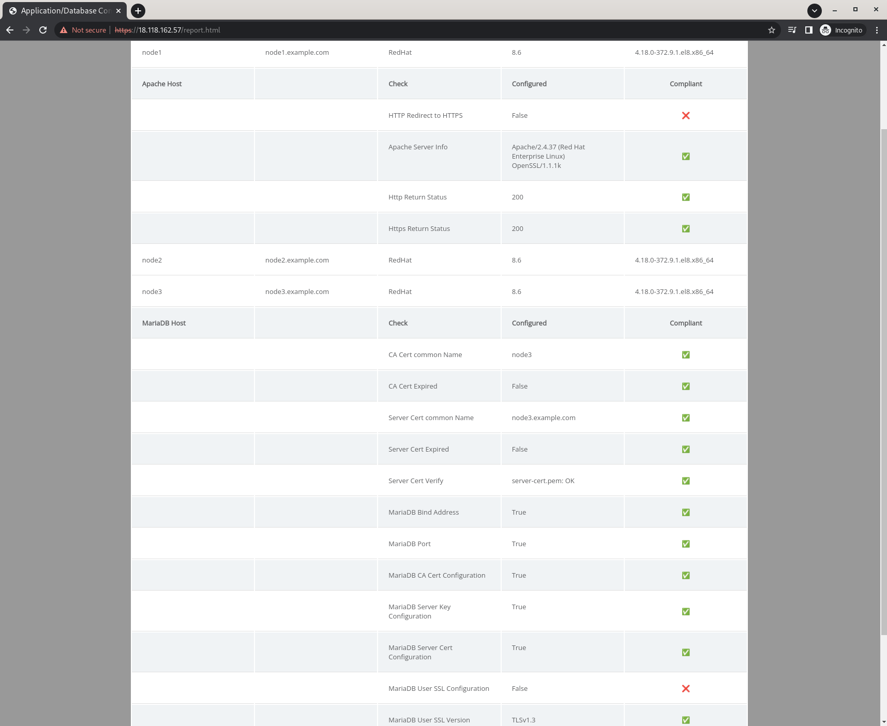

We now see that the following changes have been made to our configurations:
* **node1:** HTTP redirect to HTTPS has been disabled (Test by going to `http://<NODE1's_IP_ADDRESS>`).
* **node2:** No drift.
* **node3:** Database no longer enforces SSL for the application database user (Even though the connection from the application still uses SSL).

Through this Ansible generated report, we were able to detect any drift from our initial state even though the changes made by the `Workshop Simulate Drift` template may go by un-noticed for a long time in real life.

# Section 4: RESPOND

 We've been able to detect drift using our report, In the respond stage, we would focus on identifying the source of the drift. and once again, Ansible can be used to help!
 
 For example we would write a playbook that would fetch certain log files from the affected hosts and move them to a file server for for further investigation. You could also use Ansible to look for certain patterns in those log files to aid with the analysis. 

 In the interest of time we will not write the log collecting playbook as it is a fairly simple one, and will not have a direct impact on the purpose of this workshop (we are guilty of causing the drift ourselves).

> **Tip**
>
> The [ansible.posix.synchronize](https://docs.ansible.com/ansible/latest/collections/ansible/posix/synchronize_module.html) and [ansible.builtin.fetch ](https://docs.ansible.com/ansible/latest/collections/ansible/builtin/fetch_module.html) are useful for moving log files around.


# Section 5: RECOVER

The last stage is to fix our configurations and get our LAMP stack back in compliance with the security team's requirements, and this is where using Ansible brings a **huge** advantage. Remember discussing *idempotency* earlier? we can use the same `SSL Setup` job template we used initially to re-apply the our security configuration in order to remediate our drift. 


In Automation Controller, Select **Templates** and run the `SSL Setup` job template. The playbook will go through All the steps to configure everything based on our requirements, but will only make changes when needed, in this case will only make changes to anything that was misconfigured.


After the run completes, go back to **Templates** and run the `Generate and Deploy Report` job template again to rescan the LAMP stack and regenerate the reports. Once that is done go to the report URL at `https://<NODE1's_IP_ADDRESS>/report.html` or `https://<NODE2's_IP_ADDRESS>/report.html` and inspect the report:


We should be back to all compliant!

> **Tip**
>
> Ansible Controller has the ability to build workflows that can be used to string together multiple Job templates as a single executable entity. A lot of the steps covered in this workshop would realistically be put together in a single workflow for hands-off scanning/recovery/remediation if required. 

<br><br>

And thats it! This workshop covered the usage of Ansible and the Red Hat Ansible Automation Platform to handle all the stages of the cybersecurity framework. Take the concepts of this workshop and apply them to your specific environment and your specific technologies. If you are not a current Red Hat Ansible Automation Platform Customer, you can request a [trial](https://www.redhat.com/en/technologies/management/ansible/try-it) to evaluate using Ansible for your security processes. 

<br><br>
---

